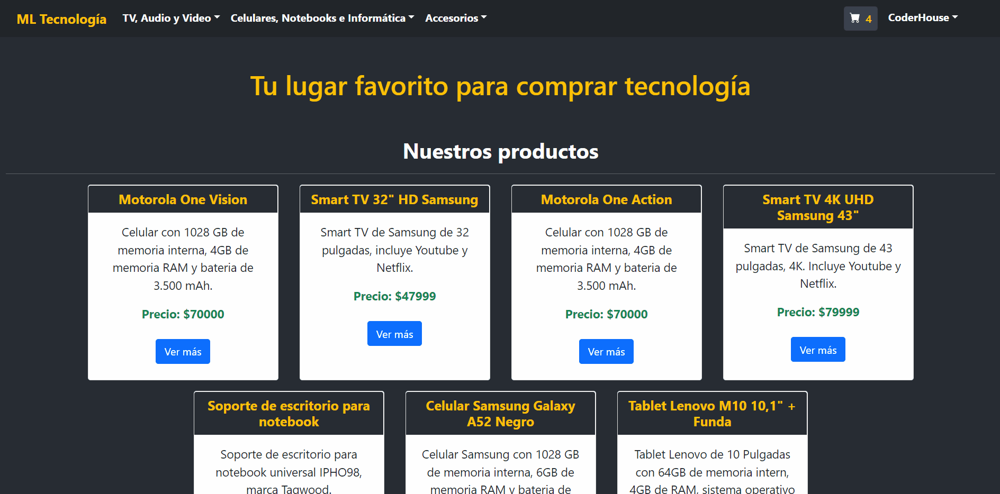

# Proyecto Final - CoderHouse - React Js: ML-Tecnologia

Este proyecto trata de un e-commerce de un local de tecnología. Donde se puede ir por las diferentes categorias de productos que presenta el local, ver más detalle de los productos y seleccionar la cantidad que se quiere agregar al carrito.

## Acceder y probar el proyecto online
Para acceder al proyecto y probarlo de manera online, acceder al siguiente enlace:
https://macalui00.github.io/ml-tecnologia/

## Pagina principal y detalle de item

## Seleccion de categoria

## Librerías utilizadas

Por el momento la única libreria que se esta utilizando es Bootstrap.
