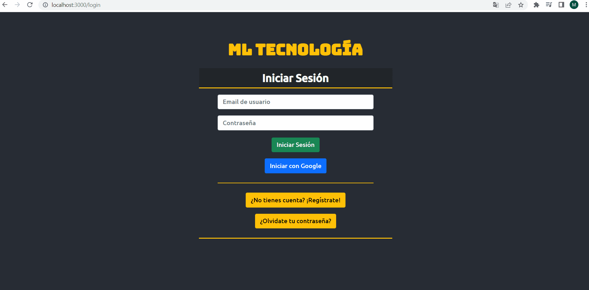
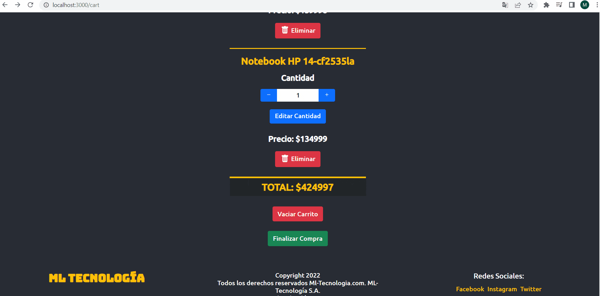
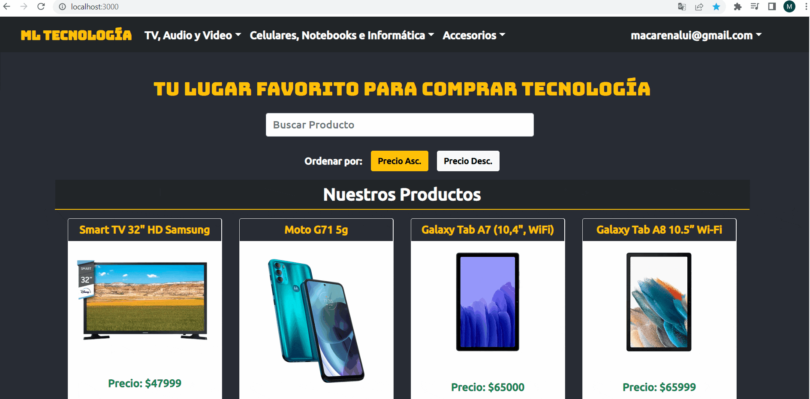

# Proyecto Final - CoderHouse - React Js: ML-Tecnologia

Este proyecto trata de un e-commerce de un local de tecnología, desde celulares hasta impresoras. Donde se puede:
- Ver el listado completo de productos desde la pantalla principal.
- Acceder a una categoria de productos en particular desde el menu.
- Buscar algún producto en particular desde el buscador.
- Ordenar los productos por precio ascendente o descendente.
- Ver el detalle de un producto en particular cliqueando en el botón "Ver más" de un producto en particular.
- En el detalle de un producto, uno puede seleccionar la cantidad y agregarlo al carrito.
- Cliqueando en el botón del carrito o en el detalle de un item que ya se encuentra en el carrito cliqueando "terminar compra", se puede acceder al detalle del carrito de compra.
- En el carrito de compras se pueden modificar las cantidades e incluso, eliminar elementos.
- Cliqueando en "Finalizar Compra" en el carrito de compras, ya uno puede completar el formulario de checkout y efectuar finalmente la compra.

## Acceder y probar el proyecto online
Para acceder al proyecto y probarlo de manera online, acceder al siguiente enlace:
https://macalui00.github.io/ml-tecnologia/

## Firebase - Autenticación y Almacenamiento
Tanto para el registro, inicio y cierre de sesión como para el almacenamiento de información (Listado de Productos, Ordenes de Compra) se utilizaron los servicios de autenticación y almacenamiento de Firebase.

Para la autenticación se utilizó tanto la autenticacion con email y contraseña como la autenticación con cuenta de gmail.

## Registro, Inicio y Cierre de Sesión
Si bien en el siguiente gif no se explora el recupero de contraseña, si se encuentra funcionando el recupero de contraseña.
Para el recupero de contraseña hay que ingresar el mail de usuario y luego en el recibirás un mail para el cambio de contraseña.

## Busqueda, Filtrado, Ordenamiento y Selección de un producto

## Selección de Producto y Funcionamiento del Carrito de Compras

## Finalización de la Compra

## Acceso al Perfil y las Ordenes de Compra de un cliente

## Librerías utilizadas

Las librerías utilizadas para este proyecto son: 
- Bootstrap
- Formik
